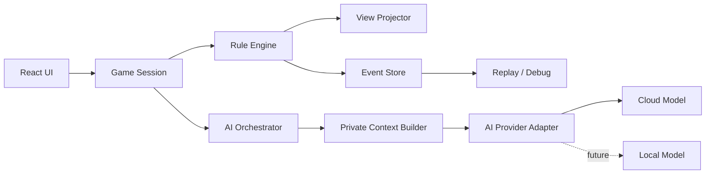

# 狼人杀 6 人 AI 单机 Demo 开发设计说明书

**文档版本**：v0.4

**状态**：规则与 AI 认知方案更新基线（暂不进入实现）

**目标读者**：产品、客户端/前端、Node.js 服务、AI 应用、测试

**适用范围**：单机文本版，1 名人类玩家 + 5 名 AI，6 人固定板子

**v0.4 核心变更**：在 v0.3 的社会博弈推理架构之上，增加有限二阶信念、信息披露策略、跨轮欺骗账本、发言意图和压力响应；允许基于信息价值进行受控试探，但禁止编造不存在的感官事实、固定降智百分比和从众硬阈值。

---

## 1. 项目概述

### 1.1 产品目标

构建一款本地启动、单人可玩的狼人杀 Demo。玩家进入一局后，与 5 名具备独立身份视角、能发言、投票和使用技能的 AI 共同完成一局 6 人狼人杀。

Demo 的核心价值不是角色数量，而是验证以下闭环：

1. 规则引擎能够无歧义地推进一局游戏。
2. AI 能在不获得非法隐藏信息的情况下参与发言和决策。
3. 人类玩家能理解当前阶段、公开信息、私密信息和可执行操作。
4. 一局可以完整回放、调试和复现。
5. AI 能把逻辑、动机、信息边界、票型和阵营收益结合起来，在关键假设被推翻后主动重规划，而不是机械执行固定剧本。

### 1.2 MVP 固定板子

| 项目 | 设计值 |
|---|---|
| 玩家数 | 6 |
| 人类玩家 | 1 名，身份随机；每局座位随机；开发模式可指定身份 |
| AI 玩家 | 5 名 |
| 角色 | 2 狼人、2 平民、1 预言家、1 女巫 |
| 阵营 | 好人、狼人，无第三方 |
| 警长 | 无 |
| 其他角色 | 不包含猎人、守卫、白痴等 |
| 交互 | 文本发言、按钮/列表选择技能和投票 |
| 胜负规则 | 屠边：平民全部死亡或神职全部死亡时狼人胜利；狼人全部死亡时好人胜利 |
| 同时满足 | 好人胜利条件优先，即狼人全部死亡时判好人胜利 |
| 身份信息 | 普通出局不翻牌；结算时揭示；开发模式可实时揭示 |
| 女巫 | 一瓶解药、一瓶毒药；默认首夜可自救，不能同夜使用两瓶药 |
| 投票平票 | 并列者进入决战台，各自发言后重投一次；再次平票无人出局 |
| 投票遗言 | 白天被投票出局者拥有一次遗言；夜间死亡者无遗言 |
| 狼人自爆 | 仅狼人拥有；仅限投票开始前；公开确认狼人身份并立即结束白天 |
| 狼人夜刀 | 可选择自己、狼队友或好人；目标正常承受狼刀 |
| 狼队协作 | 夜间私聊、提案、分工、最终确认；信息仅对狼人开放 |

“2 狼 + 2 平民 + 1 预言家 + 1 女巫”是常见 6 人配置，但女巫规则、翻牌和胜负条件在不同平台存在差异。本说明书把这些差异设计成 `RuleSet` 参数，禁止散落在 UI 或模型提示词中。

### 1.3 非目标

MVP 不处理以下问题：

- 多人联机、账号、匹配、排行榜和服务端对战。
- 语音识别、语音合成和虚拟人形象。
- 复杂角色体系、第三方阵营、剧本模式。
- 训练专用模型和模型微调。
- 严格离线推理。初版可以调用云端模型；本地模型作为后续 Provider。

## 2. 产品与规则需求

### 2.1 游戏流程

一局流程如下：

```text
创建游戏
  -> 随机座位/发牌/私密信息分发
  -> 狼队夜间私聊、提案与分工
  -> 夜晚技能行动
  -> 夜晚结算
  -> 天亮播报
  -> 存活玩家依次发言
  -> 狼人可在投票前自爆
  -> 第一次投票
  -> 若平票：决战台发言、第二次投票
  -> 放逐结算、被放逐者遗言
  -> 胜负检查
  -> 下一夜或结束
```

### 2.2 角色规则

#### 狼人

- 夜间可以选择任意一名存活玩家作为击杀目标，包括自己或狼队友；被刀狼人按正常狼刀结果死亡。
- 两名狼人互相知道身份。
- 夜间拥有仅狼队可见的私聊频道，用于交换判断、提议刀口和分配白天任务。
- 白天可以隐藏身份、倒钩队友、悍跳预言家、搅乱票型或放弃必死队友；策略由当前阵营收益决定。
- 狼人可以在白天发言阶段选择自爆；投票阶段开始后不可自爆。
- 自爆公开确认该玩家是狼人，立即结束当日讨论且跳过投票；胜负检查通过后进入夜晚。
- 自爆不再额外获得普通遗言，其自爆声明本身是最后一次公开发言。

#### 预言家

- 每晚查验一名其他存活玩家。
- 返回值只有 `VILLAGE` 或 `WEREWOLF`，不返回具体角色。
- 查验结果只进入预言家的私密事件流。

#### 女巫

- `save`：消耗解药，取消当晚狼人击杀。
- `poison`：消耗毒药，淘汰一名存活玩家。
- `save` 和 `poison` 默认不能同夜使用。
- 首夜自救由 `allowFirstNightSelfSave` 控制，MVP 默认 `true`。
- 女巫根据狼刀目标的可信度、自刀可能性、当前轮次和阵营收益自主决定救、毒或不用药，不采用固定首夜救人策略。

#### 平民

- 没有夜间技能。
- 通过公开发言、事件和投票进行推理。

### 2.3 夜晚行动顺序

为了让女巫可以看到狼刀，UI 演出顺序固定为：

1. 存活狼人进入私密狼队频道，交换判断、任务和刀口提案。
2. 狼队确认最终刀口，候选目标包含所有存活玩家，包括狼人自身和队友。
3. 女巫看到当晚刀口，选择救、毒或不使用药。
4. 预言家选择查验目标并收到结果。
5. 引擎统一结算并生成天亮事件。

逻辑上三类动作属于同一夜；任何角色都不能看到不属于自己权限的行动细节。夜晚“先后”是交互顺序，不代表角色可以读取其他角色的私密结果。

### 2.4 夜晚结算

设狼人刀口为 `K`，女巫解药目标必须为 `K`，毒药目标为 `P`：

| 条件 | 结果 |
|---|---|
| 未使用解药 | `K` 死亡 |
| 使用解药 | `K` 存活 |
| 使用毒药 | `P` 死亡 |
| `K == P` | MVP 因为不能同夜用两瓶药而不会出现 |
| 狼人刀口非法 | 引擎拒绝并要求重新提交；超时使用兜底策略 |
| 毒药目标已死亡 | 引擎拒绝并要求重新提交；超时女巫不使用毒药 |

死亡在结算完成后统一写入事件；不允许先写入一个死亡再被后续模型调用撤销。

在当前 6 人板子中没有守卫等其他免死角色，因此“零死亡平安夜”只可能由女巫成功使用解药造成。狼人自刀或刀队友不会自然形成平安夜：女巫不救则狼刀目标正常死亡，女巫救下才形成平安夜。

### 2.5 白天与投票

- 天亮只公布死亡人数和死亡座位，不公布凶手、技能来源或角色身份。
- 存活玩家按座位顺序各发言一次。
- 发言结束前，每名存活狼人都可以评估是否自爆；第一张投票提交后，自爆动作立即失效。
- AI 发言必须是游戏内声明，不自动成为系统事实。
- 每名存活玩家可以投一名其他存活玩家，也可以弃票；弃票不计入任何候选人的票数。
- 第一次平票后，所有并列目标进入决战台，按座位号依次各发言一次；其他角色不能在该阶段发言。
- 决战台发言全部进入公开上下文并更新所有存活 AI 的认知，然后只在并列目标中进行第二次投票。
- 第二次仍平票则本轮无人出局，直接进行胜负检查并进入下一夜。
- 白天被投票放逐的玩家不翻牌，并在放逐结果确定后获得一次遗言；夜间死亡者没有遗言。
- 遗言是公开事件，会进入下一轮所有存活 AI 的上下文，但不能改变已经完成的放逐。
- 放逐者遗言完成后再执行胜负检查；如果已触发结束条件，不再进入下一夜。

### 2.6 座位与公开称呼

- 每局独立随机分配 1 至 6 号座位；人类玩家不固定为 1 号，下一局必须重新随机。
- 角色分配与座位分配分别使用带 seed 的随机流程。开发模式固定人类角色时，只固定角色，不固定座位。
- 本局内座位保持不变；重新开局销毁全部上下文、重新生成座位映射。
- 公开 UI、发言、投票、狼队沟通和 AI 提示词只使用座位号，不使用玩家姓名。
- 系统内部仍使用稳定 `PlayerId` 做权限、事件和目标校验；公开事件同时保存当局座位快照。
- “2 号查杀”属于结构化查验声明；“3 号是悍跳狼”属于某个角色的主观假设，不能直接升级为引擎事实。

### 2.7 胜负判定

```ts
type WinPolicy = "WEREWOLF_SIDE_ELIMINATION";
type SimultaneousWinPriority = "VILLAGE_FIRST";
```

固定板子中的两个好人边定义为：

- 平民边：2 名平民。
- 神职边：预言家和女巫。

MVP 使用屠边规则：

- 好人胜利：存活狼人数量为 0。
- 狼人胜利：存活平民数量为 0，或存活神职数量为 0。
- 狼人达到好人人数平不直接结束游戏。

同一轮结算可能同时触发双方条件，例如最后一狼被女巫毒死、最后一个神职同时被狼刀。当前规则采用 `VILLAGE_FIRST`：先判断狼人是否全部死亡，再判断是否屠边。

```ts
function checkWin(players: PlayerState[]): Faction | undefined {
  const alive = players.filter((player) => player.alive);
  const wolves = alive.filter((player) => player.role === "WEREWOLF");
  const villagers = alive.filter((player) => player.role === "VILLAGER");
  const gods = alive.filter(
    (player) => player.role === "SEER" || player.role === "WITCH",
  );

  if (wolves.length === 0) return "VILLAGE";
  if (villagers.length === 0 || gods.length === 0) return "WEREWOLF";
  return undefined;
}
```

胜负判定必须在夜晚结算后、投票遗言后、二次平票后和狼人自爆后执行。最后一狼自爆时直接判好人胜利，不再进入夜晚。

## 3. 系统架构

### 3.1 总体架构



### 3.2 组件职责

| 组件 | 职责 | 不负责的事情 |
|---|---|---|
| `RuleEngine` | 状态迁移、合法性、行动结算、胜负 | 生成自然语言、调用模型 |
| `GameSession` | 管理一局、串联人类输入和 AI 输入 | 修改规则细节 |
| `AIOrchestrator` | 选择 AI、构建上下文、调用 Provider、重试 | 直接修改真值状态 |
| `ContextBuilder` | 生成每个角色可见的私密上下文 | 访问其他角色的完整私密信息 |
| `AgentMemoryStore` | 保存每个 AI 在本局内的独立事实、推理摘要和认知模型 | 跨局继承记忆、共享其他 AI 的主观判断 |
| `ClaimGraph` | 记录跳身份、查验、站边、攻击、保护及前后矛盾，并关联原始事件 | 判断声明真伪、直接修改角色真值 |
| `BeliefUpdater` | 根据公开事件和本人私密信息更新怀疑度、可信度、角色概率和狼坑 | 把主观推测写成规则真值 |
| `InformationBoundaryAnalyzer` | 检查发言是否超出该玩家声称身份应知范围，并列出多种可能解释 | 把一次准确推断直接判为狼人 |
| `MotiveAnalyzer` | 分析发言和投票试图推动谁出局、保护谁以及最终受益阵营 | 把受益关系自动当作共狼关系 |
| `SituationEvaluator` | 基于当前真值或角色可见信念状态模拟屠边距离、药水、昼夜行动和合法分支 | 使用单一错误轮次公式代替状态模拟 |
| `StrategyPlanner` | 根据阵营收益、风险偏好和未来轮次选择站边、刀口、救毒、悍跳、倒钩或自爆 | 生成自然语言、绕过合法动作校验 |
| `SecondOrderBeliefModel` | 维护“某座位可能如何判断另一座位”的有限二阶假设 | 无限递归信念、读取其他 AI 的真实记忆 |
| `DisclosurePlanner` | 决定私密信息立即公开、部分公开、延迟公开、继续隐藏或策略性虚构 | 改写角色真实私密事实 |
| `DeceptionLedger` | 记录虚构身份、验人、承诺、预期受众、暴露风险和止损解释 | 将谎言写入本人事实记忆或公开真值 |
| `PressureResponsePolicy` | 根据票型风险、质疑来源和剩余行动窗口调整试探、防御、归票或止损姿态 | 使用固定百分比降低逻辑能力 |
| `SpeechGenerator` | 把已确定的策略、证据和公开意图转成座位号发言 | 反向修改策略或伪造未授权事实 |
| `WolfRoomCoordinator` | 维护狼队私聊、提案、分工、队友止损和最终刀口 | 向好人或开发模式外泄露狼队信息 |
| `AIProvider` | 统一云端/本地模型接口 | 决定游戏是否合法 |
| `ViewProjector` | 从真值状态生成公开视图和玩家私密视图 | 暴露服务端真值状态 |
| `EventStore` | 追加事件、快照、回放 | 重新推导游戏规则 |
| `React UI` | 展示状态、提交人类行动、显示流式发言 | 本地判定死亡或胜负 |

### 3.3 权威边界

`RuleEngine` 是唯一权威源。模型只能返回候选意图：

```text
AI 输出 -> Schema 校验 -> 目标合法性校验 -> RuleEngine 提交 -> 事件生成
```

以下数据永远不能由模型或前端写入：

- 玩家角色和阵营。
- `alive` 状态。
- 女巫药水库存。
- 夜晚死亡结果。
- 投票结果和胜负结果。
- 私密查验事件。

## 4. 工程结构

推荐采用 TypeScript 单仓库，前后端共享类型但不共享服务端私密状态。

```text
src/
  domain/
    types.ts              # 领域类型
    ruleset.ts            # 规则配置和默认值
    errors.ts             # 领域错误
  engine/
    game-engine.ts        # 状态机入口
    setup.ts              # 发牌、座位、随机种子
    night-resolver.ts     # 夜晚结算
    vote-resolver.ts      # 投票结算
    win-checker.ts        # 胜负判定
    visibility.ts         # 视图投影
  ai/
    orchestrator.ts       # AI 阶段调度
    context-builder.ts    # 私密上下文
    memory-store.ts       # 每个 AI 的本局独立记忆
    claim-graph.ts        # 身份声明、查验、站边、保护、攻击和矛盾关系
    belief-updater.ts     # 怀疑度、可信度、角色概率和狼坑更新
    information-boundary.ts # 视角超纲检测与多解释保留
    motive-analyzer.ts    # 行为意图、受益者和阵营收益分析
    situation-evaluator.ts # 屠边距离、药水和未来合法分支模拟
    strategy-planner.ts   # 上层战略、动态重规划和行动选择
    second-order-belief.ts # 有限二阶信念与反应预测
    disclosure-planner.ts # 私密信息公开、保留、延迟和虚构策略
    deception-ledger.ts   # 狼人谎言、承诺、备用解释和暴露风险
    pressure-response.ts  # 低/中/高压力下的交流与止损姿态
    speech-generator.ts   # 下层发言表达，不参与规则决策
    perspective.ts        # 基于可见信息的换位假设分析
    wolf-room.ts          # 狼队私聊、提案、任务和最终决议
    summarizer.ts         # 轮次推理概括与关键证据压缩
    schemas.ts            # AI 输出 schema
    fallback.ts           # 兜底决策
    providers/
      provider.ts         # Provider 接口
      cloud.ts             # 云端 Provider
      local.ts             # 预留本地 Provider
  content/
    prompts.ts            # 版本化提示词
    personas.ts           # AI 性格
  replay/
    event-store.ts        # 事件追加与读取
    snapshot-store.ts     # 快照
  ui/
    components/
    pages/
    state/
server/
  app.ts
  routes/games.ts
  routes/events.ts
  routes/ai.ts
tests/
  unit/
  contract/
  simulation/
  e2e/
```

## 5. 领域模型

### 5.1 类型定义

```ts
export type PlayerId = `P${number}`;
export type SeatNo = 1 | 2 | 3 | 4 | 5 | 6;
export type Role = "WEREWOLF" | "VILLAGER" | "SEER" | "WITCH";
export type Faction = "VILLAGE" | "WEREWOLF";
export type Controller = "HUMAN" | "AI";

export type Phase =
  | "SETUP"
  | "NIGHT_WOLF"
  | "NIGHT_WITCH"
  | "NIGHT_SEER"
  | "NIGHT_RESOLVE"
  | "DAWN"
  | "DISCUSSION"
  | "SELF_EXPLODE_RESOLVE"
  | "VOTE"
  | "DUEL_SPEECH"
  | "VOTE_RETRY"
  | "LAST_WORDS"
  | "ENDED";

export interface PlayerState {
  id: PlayerId;
  seat: SeatNo;
  controller: Controller;
  role: Role;
  alive: boolean;
  removedAt?: { day: number; phase: Phase; reason: "WOLF" | "WITCH" | "VOTE" | "SELF_EXPLODE" };
}

export interface WitchState {
  saveAvailable: boolean;
  poisonAvailable: boolean;
  allowFirstNightSelfSave: boolean;
  allowSameNightBoth: boolean;
}

export interface RuleSet {
  playerCount: 6;
  rolePool: Role[];
  winPolicy: WinPolicy;
  revealRoleOnDeath: boolean;
  tiePolicy: "REVOTE_ONCE_THEN_NO_ELIMINATION";
  duelSpeechEnabled: true;
  voteEliminationLastWords: true;
  nightDeathLastWords: false;
  wolfSelfExplodeBeforeVote: true;
  wolfKillCanTargetWolves: true;
  witch: WitchState;
  firstNightHasActions: boolean;
  simultaneousWinPriority: "VILLAGE_FIRST";
}

export interface GameState {
  gameId: string;
  seed: number;
  rules: RuleSet;
  day: number;
  phase: Phase;
  players: PlayerState[];
  witchState: WitchState;
  alivePlayerIds: PlayerId[];
  pendingDecision?: PendingDecision;
  wolfNominations: Record<PlayerId, PlayerId | null>;
  currentVote?: Record<PlayerId, PlayerId | "ABSTAIN">;
  duelCandidateIds: PlayerId[];
  lastWordsPlayerId?: PlayerId;
  wolfRoom: WolfRoomState;
  winner?: Faction;
  version: number;
}
```

### 5.2 真值状态与视图状态

服务端/引擎内部保存 `GameState`。前端只能收到投影：

```ts
export interface PublicGameView {
  gameId: string;
  day: number;
  phase: Phase;
  players: Array<{
    id: PlayerId;
    seat: SeatNo;
    alive: boolean;
    revealedRole?: Role;
  }>;
  publicEvents: PublicEvent[];
  pendingDecision?: PendingDecisionView;
  winner?: Faction;
}

export interface PrivatePlayerView extends PublicGameView {
  self: {
    id: PlayerId;
    role: Role;
    faction: Faction;
  };
  privateEvents: PrivateEvent[];
  availableActions: ActionDescriptor[];
}
```

前端调试模式可以显示真值，但必须通过明确的开发开关，不得混入默认 API 响应。

### 5.3 事件模型

事件采用追加写入，事件一旦提交不可修改：

```ts
export type PublicEvent =
  | { type: "GAME_STARTED"; gameId: string; seed: number }
  | { type: "DAY_STARTED"; day: number }
  | { type: "PLAYER_SPOKE"; playerId: PlayerId; seat: SeatNo; speechKind: "NORMAL" | "DUEL" | "LAST_WORDS"; text: string }
  | { type: "NIGHT_RESULT"; deaths: PlayerId[] }
  | { type: "VOTE_RESULT"; round: 1 | 2; ballots: Array<{ voterSeat: SeatNo; targetSeat: SeatNo | "ABSTAIN" }> }
  | { type: "DUEL_STARTED"; candidateSeats: SeatNo[] }
  | { type: "PLAYER_ELIMINATED"; playerId: PlayerId; seat: SeatNo; revealedRole?: Role }
  | { type: "WOLF_SELF_EXPLODED"; playerId: PlayerId; seat: SeatNo; revealedRole: "WEREWOLF" }
  | { type: "ROLE_CLAIMED"; speakerSeat: SeatNo; claimedRole: Role }
  | { type: "SEER_RESULT_CLAIMED"; speakerSeat: SeatNo; targetSeat: SeatNo; result: Faction }
  | { type: "GAME_ENDED"; winner: Faction };

export type PrivateEvent =
  | { type: "ROLE_ASSIGNED"; role: Role; faction: Faction }
  | { type: "WOLF_TEAM_REVEALED"; teammateIds: PlayerId[] }
  | { type: "WOLF_ROOM_MESSAGE"; speakerId: PlayerId; text: string }
  | { type: "WOLF_PLAN_UPDATED"; plan: WolfTeamPlan }
  | { type: "SEER_RESULT"; targetId: PlayerId; faction: Faction }
  | { type: "WITCH_SEES_KILL"; targetId: PlayerId };
```

`PublicEvent` 可以进入所有 AI 的上下文；`PrivateEvent` 只能发送给对应玩家。

### 5.4 AI 独立记忆与认知模型

每局为每个 AI 创建独立 `AgentMemory`，只写入本人可见信息；重新开局按新 `gameId` 销毁并重建，禁止跨局继承：

```ts
export interface AgentMemory {
  gameId: string;
  playerId: PlayerId;
  selfSeat: SeatNo;
  privateFacts: PrivateFact[];
  publicRounds: RoundTranscript[];       // 本局每轮完整公开发言、遗言和票型
  claims: ClaimRecord[];                 // 跳身份、金水、查杀等公开声明
  beliefs: Record<PlayerId, PlayerBelief>;
  wolfCandidateSets: Array<{ seats: SeatNo[]; score: number; evidenceIds: string[] }>;
  perspectiveAnalyses: PerspectiveAnalysis[];
  secondOrderBeliefs: SecondOrderBelief[];
  disclosurePlan?: DisclosurePlan;
  deceptionLedger: DeceptionEntry[];
  communicationHistory: CommunicationIntentRecord[];
  roundSummaries: RoundReasoningSummary[];
  lastUpdatedSequence: number;
}

export interface PlayerBelief {
  playerId: PlayerId;
  seat: SeatNo;
  factionProbability: { village: number; werewolf: number };
  roleProbability: Record<Role, number>;
  suspicionScore: number;   // 怀疑其为狼人的程度
  trustScore: number;       // 对其发言和身份声明的信任程度
  confidence: number;       // 对当前判断的置信度
  evidenceFor: string[];
  evidenceAgainst: string[];
  contradictions: string[];
  informationBoundaryFlags: Array<{
    eventId: string;
    severity: "LOW" | "MEDIUM" | "HIGH";
    possibleExplanations: Array<"VALID_INFERENCE" | "ROLE_PRIVATE_INFO" | "WEREWOLF_INFO" | "BLUFF" | "COINCIDENCE">;
  }>;
  motiveHypotheses: Array<{
    eventId: string;
    intendedTargetSeats: SeatNo[];
    protectedSeats: SeatNo[];
    likelyBeneficiaryFaction: Faction | "UNCERTAIN";
    confidence: number;
  }>;
  lastUpdatedDay: number;
}

export interface PerspectiveAnalysis {
  assumption: string;       // 例如“假设 2 号是真预言家”
  support: string[];
  contradictions: string[];
  expectedBehavior: string[];
  confidence: number;
}

export interface SecondOrderBelief {
  subjectSeat: SeatNo;     // 我认为谁持有这个判断
  targetSeat: SeatNo;      // 他正在判断谁
  hypothesis: string;
  evidenceIds: string[];
  confidence: number;
  expiresAfterDay?: number;
}

export type DisclosureMode =
  | "REVEAL_NOW"
  | "PARTIAL_REVEAL"
  | "WITHHOLD"
  | "DELAY_UNTIL_PRESSURED"
  | "BLUFF";

export interface DisclosurePlan {
  mode: DisclosureMode;
  factIds: string[];
  intendedAudienceSeats: SeatNo[];
  expectedBenefit: string;
  exposureRisk: string;
  revealTrigger?: string;
}

export interface DeceptionEntry {
  id: string;
  day: number;
  fabricatedClaim: string;
  intendedEffect: string;
  supportingPublicFacts: string[];
  fallbackExplanation?: string;
  exposureRisk: "LOW" | "MEDIUM" | "HIGH";
  status: "PLANNED" | "ACTIVE" | "RETRACTED" | "EXPOSED";
}

export type CommunicationIntent =
  | "INFORM"
  | "CLAIM"
  | "PROBE"
  | "PERSUADE"
  | "DEFEND"
  | "DISTRACT"
  | "BAIT"
  | "DISTANCE"
  | "CONCEDE";

export interface CommunicationIntentRecord {
  day: number;
  eventId: string;
  intent: CommunicationIntent;
  targetSeats: SeatNo[];
  expectedReaction: string;
  observedOutcome?: string;
}
```

推理状态是 AI 的主观认知，不是规则真值。某 AI 对“3 号是悍跳狼”的判断只能进入该 AI 的 `beliefs` 和 `perspectiveAnalyses`，不能写入 `TruthState` 或共享给其他 AI。

`factionProbability`、`roleProbability` 和 `confidence` 在 MVP 中是用于排序和更新的**归一化假设权重**，不是经过现实样本校准的统计概率。任何分数必须能回溯到支持证据、反对证据和最近变化原因；UI 不应把 `0.72` 宣称为“72% 客观概率”。

狼队另有共享且仅狼人可见的协作状态：

```ts
export interface WolfRoomState {
  messages: Array<{ speakerId: PlayerId; text: string }>;
  proposals: Array<{ proposerId: PlayerId; targetId: PlayerId; reason: string }>;
  plan?: WolfTeamPlan;
}

export interface WolfTeamPlan {
  killTargetId: PlayerId;
  taskByWolf: Record<PlayerId, "HIDE" | "FAKE_SEER" | "PUSH_VOTE" | "BUS_TEAMMATE" | "PREPARE_SELF_EXPLODE">;
  sacrificeCandidateId?: PlayerId;
  summary: string;
}
```

## 6. 状态机设计

### 6.1 状态迁移

| 当前状态 | 事件/条件 | 下一状态 |
|---|---|---|
| `SETUP` | 随机座位和发牌完成 | `NIGHT_WOLF` |
| `NIGHT_WOLF` | 狼队私聊、提案、分工和最终刀口完成 | `NIGHT_WITCH` |
| `NIGHT_WITCH` | 女巫提交或无女巫存活 | `NIGHT_SEER` |
| `NIGHT_SEER` | 预言家提交或无预言家存活 | `NIGHT_RESOLVE` |
| `NIGHT_RESOLVE` | 夜晚结算完成 | `DAWN` 或 `ENDED` |
| `DAWN` | 播报完成且未结束 | `DISCUSSION` |
| `DISCUSSION` | 狼人合法自爆 | `SELF_EXPLODE_RESOLVE` |
| `SELF_EXPLODE_RESOLVE` | 移除自爆狼人并完成胜负检查 | `ENDED` 或 `NIGHT_WOLF` |
| `DISCUSSION` | 所有存活玩家发言完成且无人自爆 | `VOTE`；进入后自爆失效 |
| `VOTE` | 单人最高票 | `LAST_WORDS` |
| `VOTE` | 多人最高票平票 | `DUEL_SPEECH` |
| `DUEL_SPEECH` | 所有平票者按座位发言完成 | `VOTE_RETRY` |
| `VOTE_RETRY` | 单人最高票 | `LAST_WORDS` |
| `VOTE_RETRY` | 再次平票 | `ENDED` 或 `NIGHT_WOLF` |
| `LAST_WORDS` | 被放逐者遗言完成 | `ENDED` 或 `NIGHT_WOLF` |

### 6.2 `PendingDecision`

```ts
export type PendingDecision =
  | { kind: "WOLF_ROOM_MESSAGE"; playerId: PlayerId }
  | { kind: "WOLF_NOMINATION"; playerId: PlayerId; candidates: PlayerId[] }
  | { kind: "WOLF_FINAL_TARGET"; playerId: PlayerId; candidates: PlayerId[] }
  | { kind: "WITCH_ACTION"; playerId: PlayerId; killTargetId: PlayerId; candidates: WitchAction[] }
  | { kind: "SEER_CHECK"; playerId: PlayerId; candidates: PlayerId[] }
  | { kind: "SPEECH"; playerId: PlayerId; canSelfExplode: boolean }
  | { kind: "SELF_EXPLODE"; playerId: PlayerId }
  | { kind: "DUEL_SPEECH"; playerId: PlayerId }
  | { kind: "LAST_WORDS"; playerId: PlayerId }
  | { kind: "VOTE"; playerId: PlayerId; candidates: Array<PlayerId | "ABSTAIN"> };

export type WitchAction =
  | { type: "PASS" }
  | { type: "SAVE" }
  | { type: "POISON"; targetId: PlayerId };
```

只有 `pendingDecision` 中列出的玩家和目标可操作。其他请求统一返回 `INVALID_PHASE` 或 `NOT_AUTHORIZED`。

### 6.3 狼队行动协调

MVP 实现真正的私密狼队协作，而不是两个狼人各自随机行动：

1. 每名存活狼人读取自己的 `AgentMemory` 和共享 `WolfRoomState`，提交刀口提案与简短理由。
2. 双方可以进行一轮回应，讨论刀神、自刀、刀队友骗药或常规刀好人。
3. 狼队为下一白天分配 `HIDE`、`FAKE_SEER`、`PUSH_VOTE`、`BUS_TEAMMATE`、`PREPARE_SELF_EXPLODE` 等任务。
4. 若某个狼人预计必定出局，双方评估继续保护、倒钩止损、主动切割或自爆的阵营收益。
5. 双方目标一致时直接确认；不一致时由按夜数轮换的狼队长在完整狼队提案基础上决胜。
6. 人类为狼人时，UI 显示队友的私聊和提案；人类作为狼队长时确认最终刀口。
7. 狼队私聊、分工和推理只进入狼人私密事件，任何好人 AI 都不可见。

## 7. AI 集成设计

### 7.1 Provider 接口

```ts
export interface AIProvider {
  generate<T>(request: StructuredGenerationRequest<T>): Promise<T>;
  streamSpeech(request: SpeechRequest): AsyncIterable<string>;
}

export interface StructuredGenerationRequest<T> {
  model: string;
  system: string;
  context: unknown;
  schema: JsonSchema<T>;
  temperature?: number;
  timeoutMs: number;
}

export interface SpeechRequest {
  model: string;
  system: string;
  context: unknown;
  maxOutputChars: number;
  timeoutMs: number;
}
```

Provider 可以实现云端 API 或本地模型服务。游戏核心不依赖具体厂商。

线上模型接入必须支持以下两类 HTTP 协议：

1. `OPENAI_COMPATIBLE`：以 OpenAI Chat Completions 兼容格式为基线。
2. `ANTHROPIC_COMPATIBLE`：以 Anthropic Messages 兼容格式为基线。

这里的“兼容”只表示请求/响应协议兼容，不代表不同供应商对 JSON Schema、工具调用、上下文长度、流式事件和模型能力完全一致。因此 Provider 层必须做能力声明和响应归一化，不能让上层直接拼接厂商请求。

### 7.2 线上模型配置

```ts
export type ApiDialect = "OPENAI_COMPATIBLE" | "ANTHROPIC_COMPATIBLE";

export interface ModelEndpointConfig {
  id: string;
  dialect: ApiDialect;
  baseUrl: string;
  apiKeyEnv: string;
  model: string;
  chatPath?: string;
  timeoutMs: number;
  maxRetries: number;
  capabilities: {
    streaming: boolean;
    jsonObject: boolean;
    jsonSchema: boolean;
    toolCalls: boolean;
  };
}
```

示例配置：

```json
{
  "id": "primary-online",
  "dialect": "OPENAI_COMPATIBLE",
  "baseUrl": "https://provider.example.com/v1",
  "apiKeyEnv": "WEREWOLF_AI_API_KEY",
  "model": "model-name",
  "chatPath": "/chat/completions",
  "timeoutMs": 30000,
  "maxRetries": 1,
  "capabilities": {
    "streaming": true,
    "jsonObject": true,
    "jsonSchema": false,
    "toolCalls": false
  }
}
```

`baseUrl`、`chatPath`、模型名和 API Key 必须可配置，不能写死在代码中。当前本机 Demo 按产品要求将配置和 Key 明文保存在浏览器 `localStorage`，并只发送给本机代理；设置页必须提供清除入口。此方案不适用于共享电脑或正式 Web 部署，生产版本应改为服务端环境变量或系统凭据存储。

### 7.3 OpenAI-compatible 适配器

默认请求使用兼容性最高的 Chat Completions 子集：

```http
POST {baseUrl}/chat/completions
Authorization: Bearer {apiKey}
Content-Type: application/json
```

```json
{
  "model": "model-name",
  "messages": [
    { "role": "system", "content": "..." },
    { "role": "user", "content": "..." }
  ],
  "temperature": 0.7,
  "stream": false
}
```

若端点声明支持，结构化动作优先使用 `response_format` 或工具调用；否则使用 JSON 对象提示 + Schema 校验 + 一次重试。不能假设所有 OpenAI-compatible 服务都实现完整的 `response_format` 或 `tools`。

### 7.4 Anthropic-compatible 适配器

Anthropic 原生格式采用 Messages 请求，系统提示和消息列表分开：

```http
POST {baseUrl}/v1/messages
x-api-key: {apiKey}
anthropic-version: {configuredVersion}
Content-Type: application/json
```

```json
{
  "model": "model-name",
  "system": "...",
  "messages": [
    { "role": "user", "content": "..." }
  ],
  "max_tokens": 512,
  "temperature": 0.7,
  "stream": false
}
```

适配器负责把内部 `system`、`context` 和输出要求转换为 Anthropic 的内容块；上层不感知 `x-api-key`、`anthropic-version` 或内容块细节。`anthropic-version` 必须配置化，避免将版本号散落在业务代码中。

### 7.5 统一响应与流式事件

```ts
export interface NormalizedAIResponse<T = unknown> {
  text: string;
  structured?: T;
  finishReason?: "STOP" | "LENGTH" | "TOOL_CALL" | "ERROR";
  usage?: { inputTokens?: number; outputTokens?: number };
  providerRequestId?: string;
}

export type NormalizedStreamEvent =
  | { type: "TEXT_DELTA"; text: string }
  | { type: "TEXT_DONE"; text: string }
  | { type: "USAGE"; inputTokens?: number; outputTokens?: number }
  | { type: "ERROR"; code: string; message: string };
```

OpenAI-compatible SSE 和 Anthropic Messages SSE 的事件名称、内容块和结束信号不同，必须在适配器内转换为上述内部事件。`AIOrchestrator` 只处理 `NormalizedAIResponse` 和 `NormalizedStreamEvent`。

### 7.6 结构化输出降级链

不同兼容端点的结构化输出能力不能假定一致，统一采用以下降级顺序：

1. 原生 JSON Schema/structured output。
2. 工具调用，工具参数作为动作 JSON。
3. JSON object 模式。
4. 普通文本 + 明确 JSON 格式提示 + Schema 解析。
5. 失败后重试一次；仍失败则使用角色专属确定性兜底。

无论采用哪种方式，最终都必须经过 `AgentDecision` Schema 和合法目标校验。模型文本永远不能绕过 `RuleEngine`。

### 7.7 AI 上下文

每次 AI 调用使用独立 context：

```ts
export interface AgentContext {
  game: {
    gameId: string;
    day: number;
    phase: Phase;
    selfSeat: SeatNo;
    aliveSeats: SeatNo[];
    publicRounds: RoundTranscript[];
    currentRoundEvents: PublicEvent[];
    voteHistory: VoteResult[];
  };
  self: {
    id: PlayerId;
    seat: SeatNo;
    role: Role;
    faction: Faction;
    privateEvents: PrivateEvent[];
  };
  memory: {
    claims: ClaimRecord[];
    claimGraph: ClaimGraphSnapshot;
    beliefs: Record<PlayerId, PlayerBelief>;
    wolfCandidateSets: AgentMemory["wolfCandidateSets"];
    perspectiveAnalyses: PerspectiveAnalysis[];
    secondOrderBeliefs: SecondOrderBelief[];
    disclosurePlan?: DisclosurePlan;
    activeDeceptions: DeceptionEntry[];
    roundSummaries: RoundReasoningSummary[];
  };
  wolfRoom?: WolfRoomState;
  legalActions: ActionDescriptor[];
  persona: Persona;
  promptVersion: string;
}
```

上下文构建规则：

- 狼人可以看到队友 ID，但不能看到预言家查验结果或女巫药水状态。
- 狼人额外看到共享狼队频道、提案、任务和止损计划。
- 预言家只能看到自己的查验结果。
- 女巫只能看到当晚狼刀和自己的药水库存。
- 平民只有公开信息。
- 已死亡玩家不再收到任何新决策请求。
- 每个 AI 拥有独立 `AgentMemory`，包含本局全部公开发言、遗言、完整票型、自身私密信息、轮次推理概括和持续更新的认知模型。
- 每次公开事件发生后，所有仍存活且可见该事件的 AI 独立更新怀疑度、可信度、角色概率、候选狼坑和证据；不得读取其他 AI 的主观判断。
- 真假预言家、遗言和历史票型属于关键事实，压缩上下文时不可丢失；旧轮次原始发言可以归档，但必须保留逐轮摘要和证据引用。
- 换位分析只能基于该 AI 可见的信息构造假设，例如“假设 2 号是真预言家”，不能借用服务端真值。
- 所有公开自然语言只能使用座位号，如“2 号查杀”“我认为 3 号是悍跳狼”；禁止输出玩家姓名、内部 `PlayerId` 或跨局昵称。

AI 每次行动采用统一认知循环：

```text
读取新事件
  -> 区分公开事实、本人私密事实和主观声明
  -> 更新身份声明与查验记录
  -> 复盘发言、遗言和完整票型
  -> 更新怀疑度、可信度、角色概率和狼坑组合
  -> 对关键身份假设执行换位分析
  -> 生成新的轮次推理概括
  -> 根据阵营预期收益从合法动作中决策
```

### 7.8 行动输出 Schema

模型输出必须是 JSON，不能让引擎从自然语言猜行动：

```ts
export type AgentDecision =
  | { type: "SPEECH"; text: string; communicationIntent: CommunicationIntent; disclosureMode?: DisclosureMode; targetSeats?: SeatNo[]; reasoningSummary: string; beliefUpdates?: BeliefUpdate[] }
  | { type: "SELF_EXPLODE"; declaration: string; reasoningSummary: string }
  | { type: "VOTE"; targetId: PlayerId | "ABSTAIN"; reasoningSummary: string }
  | { type: "SEER_CHECK"; targetId: PlayerId; reasoningSummary: string }
  | { type: "WITCH_ACTION"; action: WitchAction; reasoningSummary: string }
  | { type: "WOLF_ROOM_MESSAGE"; text: string; proposal?: WolfProposal; reasoningSummary: string }
  | { type: "WOLF_NOMINATION"; targetId: PlayerId; taskPlan?: WolfTeamPlan; reasoningSummary: string }
  | { type: "WOLF_FINAL_TARGET"; targetId: PlayerId; taskPlan: WolfTeamPlan; reasoningSummary: string };
```

校验顺序：

1. JSON 解析。
2. Schema 校验。
3. 当前玩家权限校验。
4. 目标是否存活、是否在候选列表校验。
5. 药水是否可用校验。
6. `SELF_EXPLODE` 是否由存活狼人且仍处于投票前发言阶段提交。
7. 所有公开发言是否只引用座位号；结构化动作仍使用内部 `PlayerId`。
8. 提交到 `RuleEngine`。

### 7.9 提示词约束

每个提示词都必须包含：

- 你的座位、身份、阵营和当前阶段。
- 你能知道的私密事件。
- 本局每轮公开发言、遗言、身份声明和完整投票记录。
- 自己上一轮的推理概括、玩家认知表、候选狼坑和关键换位假设。
- 当前声明图、视角异常及其替代解释、动机/受益者分析和可追溯证据引用。
- 合法目标白名单。
- 合法动作白名单；狼人只有在投票前才能收到 `SELF_EXPLODE`。
- 输出格式和字符上限。
- 禁止声称引擎尚未确认的事实。
- 禁止使用玩家名字，只能使用 1 至 6 号座位称呼。

不要求模型输出长篇隐藏推理。开发者模式只展示面向 UI 的简短 `reasoningSummary`，且不作为规则依据；该字段不是模型隐藏思维链。

### 7.10 AI 调度策略

- 发言按座位顺序串行，保证前一个人的发言进入后一个人的上下文。
- 狼人每次发言行动前都可评估 `SELF_EXPLODE`；第一张投票提交时统一关闭自爆窗口。
- 第一次投票不展示实时票型；结算后一次性公开完整票型并写入所有存活 AI 记忆。
- 平票者决战台发言按座位顺序串行，全部发言完成并更新认知后再进行第二次投票。
- 投票出局者遗言完成后，才进入胜负检查和下一夜。
- 预言家、女巫和狼人行动按状态机顺序执行。
- 狼队夜间私聊采用“双方提案 -> 一轮回应 -> 任务分配 -> 队长决胜”，共享上下文只限狼队。
- 同一阶段的模型调用设有并发上限，默认 `1`；稳定后可对互不依赖的决策并发。
- 每个请求带 `requestId`、`gameId`、`playerId`、`phase`、`promptVersion`，便于追踪。

### 7.11 失败与兜底

| 失败 | 重试 | 兜底 |
|---|---|---|
| 网络/Provider 超时 | 1 次，指数退避 | 进入角色专属确定性策略 |
| JSON 解析失败 | 1 次，附带格式错误 | 确定性策略 |
| 目标已死亡 | 不重复请求旧结果 | 从合法目标列表选择首个候选 |
| 女巫动作与库存冲突 | 1 次提示剩余动作 | `PASS` |
| AI 发言为空或过长 | 1 次压缩 | 使用短模板发言 |

兜底策略不应使用玩家不该知道的真值信息。例如平民投票兜底只能根据公开事件随机/轮询，不能直接选择狼人。

### 7.12 社会博弈推理架构

狼人杀不是纯逻辑证明题。AI 决策必须同时处理事实一致性、发言意图、行为动机、信息边界、阵营收益和欺骗可能性。系统采用分层流水线，而不是让一次模型调用同时“盘逻辑、定策略、写发言”：

```text
EventIngestor
  -> ClaimGraph
  -> InformationBoundaryAnalyzer
  -> MotiveAnalyzer
  -> BeliefUpdater
  -> PerspectiveSimulator
  -> SituationEvaluator
  -> StrategyPlanner
  -> SpeechGenerator / ActionSchema
```

各层职责：

1. `EventIngestor` 只提取公开事实、本人私密事实和公开声明，不做身份判定。
2. `ClaimGraph` 维护谁在何时跳什么身份、给谁金水/查杀、攻击或保护谁、承诺投谁，以及后续是否自相矛盾。
3. `InformationBoundaryAnalyzer` 检查发言是否出现视角异常，但必须保留合法推断、神职私密信息、狼人信息、试探、虚张声势和巧合等竞争解释。
4. `MotiveAnalyzer` 评估一段发言或一张票试图推动谁出局、保护谁、压缩谁的发言空间，以及哪个阵营可能获益。
5. `BeliefUpdater` 综合证据更新主观认知，禁止仅凭文风、情绪或被质疑次数判定身份。
6. `PerspectiveSimulator` 在多个身份假设下重放可见证据，例如分别假设 2 号和 5 号是真预言家，比较其查验、发言和票型是否自洽。
7. `SituationEvaluator` 评估当前屠边距离、存活角色假设、药水、下一次白天/夜晚行动权和合法分支。
8. `StrategyPlanner` 选择阵营收益最高且风险可接受的合法策略。
9. `SpeechGenerator` 只负责把已选策略表达成配置长度上限内的自然发言，不能创造新私密事实或修改策略。

### 7.13 声明图与证据权重

`ClaimGraph` 至少支持以下节点和关系：

```ts
type ClaimType =
  | "ROLE_CLAIM"
  | "SEER_RESULT_CLAIM"
  | "IDENTITY_HYPOTHESIS"
  | "VOTE_INTENT"
  | "TRUST_DECLARATION"
  | "ATTACK"
  | "PROTECT";

interface ClaimNode {
  id: string;
  day: number;
  speakerSeat: SeatNo;
  type: ClaimType;
  targetSeat?: SeatNo;
  claimedValue: string;
  sourceEventId: string;
  status: "ACTIVE" | "RETRACTED" | "CONTRADICTED" | "UNRESOLVED";
}
```

证据强度从高到低分层，但不使用固定绝对分值：

1. **规则确认事实**：死亡座位、自爆狼人身份、完整票型、本人真实技能结果。
2. **本人私密事实**：预言家自己的查验、狼人队友、女巫看到的刀口和药水库存。
3. **可核对公开行为**：发言时间线、身份声明、承诺票与实际票、遗言和后续改口。
4. **动机与受益关系**：谁推动谁出局、谁保护谁、某个结果对哪个阵营有利。
5. **语言风格信号**：语气、强硬程度、重复辩解等。当前文本 Demo 仅作为极低权重辅助信号，不得用于定罪。

发言“逻辑严密”不自动增加好人概率。AI 重点检查：信息边界是否合理、前后是否一致、是否解释了新证据、发言与投票是否一致，以及行为最终服务于谁的阵营收益。

### 7.14 动机、受益者与反事实分析

每个关键发言和投票都生成可审计的动机假设：

```text
该行为试图让谁被放逐？
该行为保护了谁？
如果目标是好人，谁获益？
如果目标是狼人，是否可能是倒钩止损？
发言者是否兑现了自己的归票承诺？
存在什么不需要“多人同时严重失误”就能解释当前行为的方案？
```

受益关系不是共狼铁证。狼人可以卖队友，好人也可能错误保护狼人；因此必须同时记录支持解释和反对解释，并在后续死亡、遗言、查验声明和票型出现时重新更新。

### 7.15 局势评估与动态重规划

不采用 `min(神剩余, 民剩余) - 狼数量` 作为“剩余轮次”公式。该公式在开局就会得到 `0`，但对局显然未结束，也没有纳入药水、自刀、自爆、白天放逐和行动顺序。

规则层只提供精确状态量：

```text
狼人距离屠边的基础人数 = min(存活平民数, 存活神职数)
好人距离胜利的基础人数 = 存活狼人数
```

策略层在角色不可见时使用信念状态，并通过合法后继状态模拟评估：

- 本轮白天能否放逐关键目标。
- 今夜狼刀、自刀、解药和毒药可能产生的死亡组合。
- 自爆是否能阻止讨论并换取夜间行动；最后一狼自爆是否直接导致好人胜利。
- 保存或使用药水对下一轮屠边距离的影响。
- 保护必死狼队友、倒钩切割或让其自爆的期望收益。

触发动态重规划的事件至少包括：

- 核心身份假设被新公开事实直接否定。
- 真假预言家的查验、遗言或票型出现重大矛盾。
- 狼队友被查杀或进入高概率必死状态。
- 女巫药水状态发生变化。
- 平票决战发言改变主要站边。
- 自爆、夜间死亡或票型使屠边距离发生变化。

重规划时允许大幅降低旧结论权重并重建候选狼坑；禁止为维护上一轮结论而忽略反证。

### 7.16 策略原则的工程化表达

“知、诈、势”只作为策略设计原则，不直接进入规则判定：

- **知**：通过独立信息边界、声明图、历史记忆和换位分析理解自己知道什么、别人可能知道什么。
- **诈**：狼人可以悍跳、倒钩、卖队友、自刀和制造虚假叙事；所有欺骗必须通过合法公开声明或合法动作完成。
- **势**：评估谁拥有下一轮发言权、夜间行动权、药水资源和归票影响力，并主动选择能改善阵营未来局面的行为。

### 7.17 禁止直接采用的启发式

以下规则不得写入 `BeliefUpdater`：

- “被多人质疑但没有自爆，所以更像狼人。”质疑可能同源，且好人没有自爆能力。
- “发言逻辑严密，所以更像好人。”狼人同样可以组织完整逻辑。
- “准确推断未公开信息，所以必然是狼人或神职。”准确可能来自合法推理、试探或巧合。
- “过度辩解、情绪激动、停顿或语速异常，所以是狼人。”当前文本 Demo 没有可靠多模态信号，未来语音版也只能作为低权重特征。
- “脚步声、狗叫、呼吸、敲桌或停顿”可以作为夜间证据。当前游戏没有这些感官事件，引用它们属于信息越权或世界事实幻觉。
- “女巫救了我”“我知道首刀时间点”等未经角色授权的私密信息。
- “平安夜等于某个被救玩家一定是好人。”平安夜只确认女巫使用了解药，不确认刀口阵营。
- “受益者就是狼人。”好人误判、狼人卖队友和刻意制造受益关系都可能产生相同表象。
- “警徽流、情侣关系等可以用于推理。”当前 6 人板子没有警长、丘比特或情侣；只能使用预言家的公开验人计划。
- “同一白天可以异步连续自爆。”第一次自爆立即结束白天；最后一狼自爆会触发好人胜利。
- “进入投票后用时间压力迫使狼人自爆。”当前规则投票阶段禁止自爆，且没有强制实时倒计时。

上述信号可以形成待验证假设，但必须附带反例、替代解释、证据引用和置信度，不能单独决定投票或技能动作。

### 7.18 有限二阶信念

AI 可以推测“某个座位如何理解另一个座位”，但只保留与当前行动相关的有限假设：

```text
一阶：我认为2号可能是狼人。
二阶：我认为2号相信5号是真预言家。
```

二阶信念只能依据公开发言、票型、身份声明和可见行动推导，不能读取被推测对象的真实 `AgentMemory`。不支持无限递归的“我认为他认为我认为……”；最多保留一层二阶，旧假设可在本轮结束后过期。

二阶推理的用途包括：

- 预测某个玩家会保护、攻击或放弃谁。
- 判断某个预言家是否在利用他人对自己的预期。
- 评估一次试探会暴露谁的立场。
- 推测狼队是否正在切割一名必死队友。

二阶假设不是对方真实思想的读取结果，只能作为行动风险评估的一部分。

### 7.19 信息披露与受控试探

角色掌握私密事实后，可以选择披露时机和披露粒度。`DisclosurePlanner` 先决定信息策略，再由 `SpeechGenerator` 组织文字：

```text
REVEAL_NOW            立即公开身份或查验
PARTIAL_REVEAL        只公开查杀、金水或部分药水信息
WITHHOLD              暂不公开，继续观察
DELAY_UNTIL_PRESSURED 被质疑或进入决战台/遗言时再公开
BLUFF                 狼人虚构身份或查验，写入欺骗账本
```

约束：

- 公开声明可以是谎言，但不能把谎言写成引擎事实。
- 女巫知道狼刀目标，被刀玩家不知道自己被刀或被救；发言不得越过此信息边界。
- 平民不能声称拥有夜间私密信息。
- 所有角色都可以保留主观判断，但不能伪造不存在的角色、技能或游戏阶段。
- 受控试探必须标记为 `PROBE` 或 `BAIT`，并记录预期反应、误导成本和验证条件。
- 试探结果不能直接证明身份；必须等待后续改口、投票、站边或行动进行交叉验证。

### 7.20 狼人欺骗账本

狼人使用 `BLUFF`、`DISTANCE` 或 `BAIT` 时，必须在私密记忆中记录：

```text
虚构身份：预言家
虚构查验：首夜2号为好人
公开目标：推动5号进入放逐位
队友配合：4号不强保，准备倒钩
备用解释：声称首夜信息不足或误记目标
暴露风险：真预言家报出冲突查验
止损动作：撤回身份、切割队友或投票前自爆
```

账本的作用是保持跨轮叙事一致，不是要求狼人每次固定使用“一个高可信细节 + 一个破绽”。模型可以选择不撒谎、半真半假或直接切割，选择依据是阵营收益和暴露风险。

### 7.21 发言意图与压力响应

每段公开发言都应有一个内部 `CommunicationIntent`，例如告知、声明、试探、说服、防御、转移、诱饵、切割或认输止损。公开 UI 只显示文本；开发者模式可显示意图和预期反应。

压力响应采用离散姿态，不使用“逻辑性降低 10%”等不可测比例：

```text
LOW_PRESSURE       收集信息、要求站边、保留多个假设
MEDIUM_PRESSURE    只回应最高优先级矛盾，明确给出目标和证据
HIGH_PRESSURE      集中防御、组织归票、解释最大反证
SACRIFICE_PRESSURE 避免拖累队友，准备倒钩、切割、遗言或自爆
```

压力来源包括可信玩家质疑、票型风险、身份声明冲突和胜负窗口，不包括单纯的情绪强度。存活玩家仍必须完成规则要求的发言；“沉默战术”只能表现为极简但合法的发言，不能跳过行动。

### 7.22 人味与策略多样性验收

“像人”不等于随机犯错或故意降低逻辑。策略多样性应来自：

- 多个预期收益接近的合法动作。
- 不同人格的风险偏好和披露偏好。
- 对同一证据的不同二阶假设。
- 狼队协作、切割和止损方案不同。

模型可以在收益差距低于配置阈值的候选动作中采样，但每次都必须保留行动依据、风险和证据。开发者模式应能解释“为什么这次选择了倒钩而不是保队友”，而不是只显示随机数。

## 8. 服务端接口

### 8.1 创建游戏

`POST /api/games`

请求：

```json
{
  "seed": 12345,
  "ruleset": "six_standard_v1",
  "humanRoleMode": "RANDOM"
}
```

响应：

```json
{
  "gameId": "g_01J...",
  "view": {
    "phase": "NIGHT_WOLF",
    "day": 1,
    "selfSeat": 3,
    "players": []
  }
}
```

### 8.2 获取玩家视图

`GET /api/games/:gameId/view`

- 仅返回当前人类玩家可见数据。
- 不返回完整角色池、AI 私密事件或未授权调试数据。

### 8.3 提交人类行动

`POST /api/games/:gameId/actions`

请求：

```json
{
  "requestId": "req_123",
  "action": {
    "type": "VOTE",
    "targetSeat": 2
  }
}
```

响应：

```json
{
  "accepted": true,
  "version": 42,
  "view": {}
}
```

错误：

```json
{
  "accepted": false,
  "error": {
    "code": "INVALID_TARGET",
    "message": "目标已经出局"
  }
}
```

### 8.4 事件流

`GET /api/games/:gameId/events`，使用 SSE。

事件类型建议：

- `game.state_changed`
- `game.public_event`
- `game.duel_started`
- `game.last_words_started`
- `game.wolf_self_exploded`
- `wolf.room_message`（仅狼队）
- `wolf.plan_updated`（仅狼队）
- `ai.speech_started`
- `ai.speech_delta`
- `ai.speech_completed`
- `ai.thinking`
- `game.error`
- `game.ended`

SSE 只推送当前玩家可见内容。AI 私密动作只转换为该玩家可见的私密事件，不广播给其他角色。

### 8.5 回放接口

- `GET /api/games/:gameId/replay`：返回公开事件和已保存的模型输出。
- `GET /api/games/:gameId/debug`：仅开发环境启用，返回真值状态、私密事件和 AI 决策摘要。当前纯前端 Demo 由本地状态直接渲染同等信息。

## 9. 前端设计

### 9.1 页面结构

MVP 只需要三个页面状态：

1. **开始页**：玩家名、规则摘要、是否开启开发模式、开始游戏。
2. **对局页**：桌面座位、阶段提示、事件/发言时间线、私密信息、行动区。
3. **结算页**：胜负、完整身份、关键事件、重新开始和回放。

### 9.2 对局页组件

```text
GameTable
  ├─ PhaseBanner
  ├─ PlayerSeat[6]
  ├─ PublicTimeline
  ├─ PrivateRolePanel
  ├─ WolfRoomPanel (wolf only)
  ├─ SpeechComposer
  ├─ ActionPanel
  ├─ VotePanel
  ├─ DuelSpeechPanel
  ├─ LastWordsPanel
  ├─ SelfExplodeAction (wolf only, discussion only)
  └─ DebugDrawer (dev only)
```

交互要求：

- 当前可操作目标有明确选中态，已死亡目标不可点击。
- 所有玩家只显示 1 至 6 号座位；人类玩家标记为“你 · X 号”，不显示名字。
- 每局开始清晰提示本局人类座位；下一局重新随机。
- AI 思考时显示阶段和对应玩家，不阻塞浏览器主线程。
- 狼人视角显示仅狼队可见的夜间私聊、提案、任务分工和最终刀口确认。
- 发言阶段的狼人拥有明确自爆动作；进入投票后该动作必须消失且服务端拒绝旧请求。
- 平票后只显示决战台角色发言区；被放逐者显示一次遗言输入或 AI 遗言状态。
- 发言流式显示，但未完成的文本不能进入正式事件日志。
- 所有行动提交后显示确认态，避免重复点击。
- 错误提示必须包含可恢复操作，不显示堆栈或 API Key。

### 9.3 UI 状态

前端不自行维护一套完整游戏逻辑，只维护：

- `PublicGameView`。
- 当前玩家私密视图。
- SSE 连接状态。
- 当前输入草稿。
- UI loading/error 状态。

开发者抽屉可以显示每个 AI 的独立认知快照、推理概括和狼队私聊，但必须明确标注为调试真值，不得混入正常玩家公开时间线。

收到新的服务端版本后，以服务端视图覆盖本地状态；不做乐观更新来修改存活或胜负。

## 10. 存档与回放

### 10.1 事件日志

```ts
interface StoredEvent {
  sequence: number;
  gameId: string;
  timestamp: string;
  type: string;
  visibility: "PUBLIC" | "PRIVATE" | "DEBUG";
  audience?: PlayerId | PlayerId[];
  payload: unknown;
}
```

MVP 先写 JSONL 文件，字段稳定后再迁移 SQLite。引擎每提交一个合法动作就追加事件。

`AgentMemory` 是可重建的派生状态：事件日志保存公开事件、本人私密事件、模型决策摘要和定期认知快照；回放时可以选择直接恢复快照，或从事件重新运行 `BeliefUpdater`。狼队频道事件的 `audience` 只能是当局存活狼人。

### 10.2 可复现性

- 角色分配、玩家座位、AI 人格和兜底策略使用带 seed 的 RNG；人类座位与角色分别随机。
- AI 输出不是天然确定性的，因此回放必须保存最终模型响应和经过校验的动作。
- 开发模式支持“使用原模型输出回放”和“跳过 AI 直接重放事件”两种方式。

## 11. 安全与隐私

### 11.1 API Key

- 当前本机 Demo 按产品要求将 API URL、模型配置和 API Key 明文保存在当前浏览器 `localStorage`，刷新后自动回填。
- 设置页必须提供“清除本地配置”；文案明确提示不适用于共享电脑和正式 Web 部署。
- 浏览器只把 Key 发送给本机代理，再由本机代理请求 OpenAI-compatible 或 Anthropic-compatible Provider。
- 正式发布版本迁移到服务端环境变量、操作系统凭据存储或桌面壳安全存储，不沿用浏览器明文方案。
- 日志中对 Authorization、请求头和 Provider 原始密钥做脱敏。

### 11.2 隐藏信息隔离

- `TruthState` 不发送给浏览器生产接口。
- 每个 AI 的 context 由 `ContextBuilder(playerId)` 单独生成。
- 每个 AI 的 `AgentMemory` 独立存储；普通角色不能读取狼队频道、其他 AI 的认知表或服务端真值。
- 普通出局不翻牌；只有狼人自爆事件公开确认其狼人身份。
- 人类玩家输入的文本视为不可信游戏内容，不能覆盖系统规则或角色私密信息。
- 原始 AI prompt 和响应只在开发模式保存，生产日志默认只保存摘要。

### 11.3 资源控制

- 发言字符上限，防止模型输出过长。
- 单局最大天数和最大模型调用次数，可配置；超过上限进入平局/异常结束，并记录原因。
- Provider 超时、重试和并发数可配置。

## 12. 测试设计

### 12.1 单元测试

必须覆盖：

- 发牌数量、角色数量和随机种子复现。
- 人类和 AI 座位每局随机且 1 至 6 不重复；固定人类角色时座位仍随机。
- 不能投自己、不能投死人；可以弃票；不能重复使用女巫药水。
- 狼人可刀自己或狼队友；未救则目标死亡，成功解救才可能形成零死亡平安夜。
- 女巫自主选择救、毒或不用药；毒药目标和药水库存必须合法。
- 女巫毒药、首夜自救、不能同夜双药。
- 预言家查验只返回阵营。
- 投票平票后只有并列者进入决战台并各发言一次；二次平票无人出局。
- 白天被投票出局者获得一次遗言且不翻牌；夜间死亡者没有遗言。
- 狼人仅在投票前可以自爆；自爆公开狼人身份、跳过投票且不再获得普通遗言。
- 第一张投票提交后，迟到的自爆请求必须被拒绝。
- 夜后、投票遗言后、二次平票后和自爆后胜负检查。
- 平民边全部死亡时狼人胜利。
- 神职边全部死亡时狼人胜利。
- 狼人全部死亡时好人胜利。
- 同轮同时屠边且狼人全部死亡时，按 `VILLAGE_FIRST` 判好人胜利。
- 游戏结束后拒绝所有新行动。

### 12.2 属性/不变量测试

对任意合法行动序列，必须满足：

```text
alivePlayerIds == players.filter(p => p.alive).map(p => p.id)
死亡玩家不会重新变为存活
药水库存只会减少不会增加
事件 sequence 单调递增且不重复
ENDED 状态不会迁移到其他状态
任何公开视图不包含未授权角色或查验结果
每局 seat 集合严格等于 {1,2,3,4,5,6}
普通出局事件 revealedRole 为空
SELF_EXPLODE 只可能由存活狼人且发生在 DISCUSSION
进入 VOTE 后所有合法动作都不包含 SELF_EXPLODE
零死亡平安夜必然存在当夜成功 SAVE 事件
每个 AgentMemory.gameId 等于当前对局且只能包含该角色可见事件
公开发言和回放不得出现玩家姓名或内部 PlayerId
```

### 12.3 AI 合约测试

- Provider 返回合法 JSON 时，Orchestrator 能生成正确领域动作。
- 返回未知 action、死人目标、空文本、超长文本时，能重试或兜底。
- 预言家上下文中不出现女巫库存；平民上下文中不出现任何查验结果。
- 狼队上下文包含狼队频道但不包含神职真值；好人上下文不出现狼队私聊和任务分配。
- 重开一局后所有 `AgentMemory`、认知分数、狼坑、轮次摘要和狼队计划均为空。
- 每轮公开发言、决战台发言、遗言和完整票型均能进入下一轮对应 AI 上下文。
- 换位分析只使用该 AI 可见证据，不引用真实角色表。
- `ClaimGraph` 能记录身份声明、查验、攻击、保护、投票承诺、撤回和矛盾，并回溯到原始事件。
- 信息边界异常必须同时输出多个可能解释，不能将一次准确推断直接判为狼人。
- `StrategyPlanner` 只能输出合法策略动作，`SpeechGenerator` 不能反向修改动作或增加私密事实。
- 主观分数必须保留证据和变化原因，不得把归一化权重展示为客观统计概率。
- “被多人质疑”“发言严密”“情绪激动”和“单纯受益”均不能作为单一身份判定条件。
- `SecondOrderBeliefModel` 最多生成一层二阶信念，且只能引用该 AI 可见的公开事件和本人私密事实，不能读取其他 AI 的真实记忆。
- `DisclosurePlanner` 对预言家、女巫、平民和狼人分别生成符合信息边界的披露方案，并能在立即公开、部分公开、保留和受压公开之间选择。
- `DeceptionLedger` 能跨轮保存狼人已公开的虚构身份、查验、承诺、备用解释和止损动作；后续发言若与账本冲突，必须显式识别风险而非静默改写历史。
- 每段模型发言必须返回合法 `CommunicationIntent`；意图只用于规划和调试，不能被写成公开事实或直接改变规则动作。
- 当前文本版生成脚步声、狗叫、呼吸、音量、语速、敲桌等不存在的观测时必须重试或清除；任何角色都不得声称拥有其身份无权知道的私密信息。
- `PROBE` 和 `BAIT` 的观察结果只能形成待验证假设，不能直接升级为身份事实或单独触发投票、用毒等高影响动作。
- 输出玩家称呼只能使用座位号；出现名字或内部 ID 时应重试或规范化。
- Provider 超时时，游戏状态不回滚、不重复结算。

### 12.4 模拟测试

使用固定种子运行至少 100 局，统计：

- 是否出现死循环或无法推进的阶段。
- 非法动作率。
- 平均天数和模型调用数。
- 好人/狼人胜率。
- AI 发言和投票是否稳定完成。
- 真假预言家对跳后，AI 的历史判断不会因换夜或角色死亡被清空。
- 关键假设被反证后，AI 能降低旧假设权重、生成新的狼坑和新行动计划，而非机械保持原结论。
- 同一事实在不同身份假设下能生成支持、矛盾和预期行为，而不是只保留单一路径。
- 发言内容、投票承诺和实际票型之间的矛盾能进入声明图并影响下一轮判断。
- 同一公开行为在“发言者是好人”和“发言者是狼人”等竞争假设下能产生不同的动机解释，并保留各自支持证据和反证。
- 公开站边、保护对象、攻击目标、投票承诺和实际票型不一致时，AI 能跨轮追踪矛盾，而不是只评价最后一张票。
- 多次相同种子、相同局势但不同人格配置的对局中，策略差异来自风险偏好、披露偏好或近似收益动作采样，不来自随机制造信息越权、失忆或逻辑破坏。
- 局势评估使用合法后继状态模拟，不使用单一“剩余轮次”公式。
- 狼队是否能完成提案、任务分配、自刀、切割队友和自爆收益判断。
- 女巫是否会在不同证据和局势下产生救、毒、保药等不同合法策略，而非固定动作。
- 普通出局、自爆、决战台、遗言和第二次投票是否均无死循环。

胜率只是调平衡指标，不是引擎正确性的证明；不同胜负规则、模型和性格配置会产生不同结果。

### 12.5 E2E 测试

E2E 场景集至少包含：

1. 创建游戏。
2. 使用多个固定 seed 创建新局，确认人类座位可落在不同位置，且公开称呼全部使用座位号。
3. 作为平民或神职完成夜晚/白天交互。
4. 提交一次发言和一次投票。
5. 覆盖一次平票决战发言或投票遗言。
6. 单独覆盖狼人夜间私聊、自刀/刀队友和投票前自爆流程。
7. 看到结算页和身份揭示。
8. 点击回放，公开事件、私密事件和各 AI 认知摘要顺序与原局一致。

## 13. 非功能指标

以下是 Demo 验收目标，不是已验证事实：

| 指标 | 目标 |
|---|---|
| 规则引擎单测 | 核心分支覆盖率不低于 90% |
| 固定种子完整对局 | 100 局无崩溃、无状态非法 |
| AI 结构化动作 | 合法动作成功率不低于 99%，其余进入兜底 |
| UI 交互 | 人类提交行动后 200ms 内显示提交中状态 |
| AI 行动延迟 | 目标 p95 小于 8 秒，超时必须可恢复 |
| 回放 | 事件顺序、死亡结果和胜负结果与原局一致 |
| 信息泄漏 | 默认视图和 AI context 不出现未授权真值信息 |
| 认知可追溯 | 每次怀疑度、可信度和策略变化均能回溯到事件证据与替代解释 |
| 二阶信念边界 | 最多一层二阶信念；所有输入可回溯到该 AI 可见事件，不读取其他 AI 私有记忆 |
| 信息披露一致性 | 披露内容符合角色信息边界，并能回溯到披露方案、触发条件和已公开历史 |
| 欺骗账本一致性 | 狼人跨轮声明与既有欺骗记录一致；冲突必须被标记并进入止损或重规划 |
| 重规划 | 核心假设被明确反证后，下一次决策前完成认知和策略更新 |
| 策略/表达隔离 | 发言生成不得改变已通过 Schema 校验的策略动作 |
| 发言意图可追溯 | 每段发言均有合法内部意图、目标座位和预期反应，且不污染公开事实 |

## 14. 开发分期

### M0：工程骨架

交付：项目初始化、共享类型、RuleSet、错误码、固定 seed RNG、基础测试命令。

退出条件：能创建空游戏并返回版本化状态。

### M1：规则引擎

交付：随机座位、发牌、夜晚结算、自刀/刀队友、投票、决战台、遗言、自爆、胜负和事件日志。

退出条件：不接模型也能用脚本完成 100 局固定种子模拟。

### M2：确定性 AI 与前端

交付：规则型 Bot、座位号桌面、狼队私聊、私密/公开视图、决战与遗言面板、自爆动作、结算页和开发揭示。

退出条件：完全不依赖外部 API 也能在浏览器里完整玩一局。

### M3：模型 Provider

交付：云端 Provider、每 AI 独立 `AgentMemory`、`ClaimGraph`、信息边界和动机分析、认知更新、有限二阶信念、信息披露策略、受控试探、狼人欺骗账本、发言意图、压力响应、换位假设、局势模拟、策略规划/发言生成分层、轮次摘要、结构化输出校验、重试、兜底、SSE 发言流和调用日志。

退出条件：5 个 AI 都能用独立视角完成一局。

### M4：回放与质量验证

交付：JSONL/SQLite 存档、回放、模拟统计、上下文泄漏测试、E2E 测试。

退出条件：固定种子和真实试玩均无阻塞性问题。

### M5：可选包装与本地模型

交付：Tauri/Electron 壳、本地 Provider、模型设置、离线可选模式。

退出条件：桌面版不改变引擎行为，Provider 可切换。

## 15. 风险与决策记录

| 风险/决策 | 处理方式 |
|---|---|
| 屠边规则导致对局过短或胜率失衡 | 不改胜负定义，先通过模拟数据调整 AI 策略、女巫规则和发言轮数 |
| AI 可能幻觉式声称自己是预言家 | 所有自称都只是公开发言，不进入引擎事实 |
| 推理摘要被误当成事实 | 事实、公开声明、私密事实和主观认知分层存储；`BeliefUpdater` 不能修改真值状态 |
| 模型把语言流畅度当身份强证据 | 文风和情绪只允许低权重辅助；优先使用信息边界、时间线、票型和行为一致性 |
| 二阶信念无限递归导致上下文膨胀和伪精确 | 最多保留一层二阶，只保存与当前行动相关且有可见证据的假设，轮末清理低价值项 |
| 用固定比例“降智”制造人味 | 禁止随机破坏逻辑、记忆和信息边界；策略差异来自近似收益动作、人格风险偏好和披露偏好 |
| 模型编造感官环境作为证据 | 当前文本版没有感官事件；在 Schema 后处理和合约测试中拦截脚步声、狗叫、呼吸、音量等声明 |
| 将语言风格或情绪表演误当身份强证据 | 仅允许作为极低权重辅助观察，不能单独更新角色结论或触发高影响动作 |
| 主观分数制造虚假精确感 | 分数只作排序权重，必须附证据、反证和变化原因；UI 使用低/中/高或明确标注“主观权重” |
| 动机分析把受益者直接判狼 | 强制生成替代解释，考虑好人误判、狼人卖队友和刻意制造受益关系 |
| 策略和发言在同一调用中互相污染 | StrategyPlanner 先冻结合法动作，SpeechGenerator 只能表达已冻结策略 |
| 上下文跨轮丢失关键判断 | 每轮保存完整公开记录、结构化声明、票型、认知快照和推理概括；关键事实禁止摘要删除 |
| 上下文过长导致成本和注意力下降 | 近期保留原文，旧轮次归档；查验、身份声明、遗言、票型和矛盾证据永久保留到本局结束 |
| 狼队私聊泄漏给好人 | 狼队事件使用多人私密 audience，增加 ContextBuilder 权限和快照泄漏测试 |
| 狼人策略变成固定脚本 | 以合法动作 + 阵营收益评估决策；模拟验证隐藏、悍跳、倒钩、自刀和自爆均可在不同局势出现 |
| 模型获得其他角色信息 | context 按玩家独立生成，增加自动泄漏检测 |
| AI API 不稳定 | Provider 超时、一次重试、角色专属兜底；规则状态不依赖模型完成 |
| 人类玩家中途刷新 | 服务端/本地 Session 持久化，按 `gameId` 恢复公开视图和自己的私密视图 |
| 规则后续变更 | 规则参数化 + 事件版本化 + 固定 seed 回归 |
| “单机”被理解为完全离线 | 产品文案明确区分本地运行和离线推理；本地模型作为后续能力 |

## 16. 待确认配置

本轮已冻结：

1. 女巫首夜允许自救，且自主决定救、毒或不用药。
2. 普通死亡不翻牌，结算揭示；自爆公开确认狼人身份。
3. 白天投票出局者有一次遗言；夜间死亡者无遗言。
4. 第一次平票后并列者依次发言，再进行第二次投票；再次平票无人出局。
5. 狼人只能在投票前自爆；投票开始后不可自爆。
6. 狼刀可以选择自己、狼队友或好人；零死亡平安夜只由解药造成。
7. 狼人夜间拥有私聊、提案、任务分配和最终刀口协作。
8. 普通公开称呼只使用座位号；人类和 AI 座位每局重新随机。
9. 每个 AI 拥有独立本局记忆、认知模型、狼坑和换位分析；重开后全部清空。
10. 同轮同时满足好人和狼人胜利时，好人优先。
11. AI 采用“事件解析 -> 声明图 -> 信息边界/动机分析 -> 认知更新 -> 换位模拟 -> 局势评估 -> 策略规划 -> 发言生成”的分层架构。
12. 主观角色分数仅作为归一化假设权重，必须附带证据、反证和变化原因，不宣称为客观概率。
13. 多人质疑、语言严密、情绪信号、单纯受益和一次视角异常均不得独立决定身份判断。
14. 局势评估使用合法状态分支和技能资源，不采用 `min(神剩余, 民剩余) - 狼数量` 作为轮次公式。
15. 二阶信念最多保留一层，并且只能由该 AI 可见信息推导，不能读取其他角色的真实记忆。
16. 披露计划、发言意图和狼人欺骗账本属于角色私有认知，不进入公开事实；开发者模式可只读查看。
17. 当前文本板没有夜间环境和语音观测，禁止生成脚步声、狗叫、呼吸、音量、语速等感官证据。
18. 策略多样性只能来自合法近似收益动作、风险偏好、披露偏好和二阶假设差异，不能依赖随机失忆或破坏逻辑。

仍需产品确定：AI 单次发言长度、狼队私聊最大往返次数和单局最大天数；这些均应配置化，不写死。

## 17. 验收清单

- [ ] 可以启动本地服务并创建一局。
- [ ] 角色池严格为 2 狼、2 民、1 预言家、1 女巫。
- [ ] 人类座位和 AI 座位每局随机，公开信息仅使用 1 至 6 号称呼。
- [ ] 人类和 AI 只看到各自合法信息。
- [ ] 每个 AI 的独立记忆包含本局全部公开轮次、自身私密信息、票型、认知表和推理概括，重开后清空。
- [ ] 狼队可以私聊、提案、分工，并选择自己、队友或好人作为刀口。
- [ ] 夜晚行动、女巫自主救毒、预言家查验均可完成；平安夜只由成功解药造成。
- [ ] 白天发言、投票、决战台发言、二次投票和放逐遗言均可完成。
- [ ] 狼人仅在投票前可自爆，自爆公开狼人身份并立即结束白天。
- [ ] AI 能持续更新怀疑度、可信度、角色概率和候选狼坑，并基于可见信息完成换位假设。
- [ ] AI 能追踪身份声明、查验、站边、保护、攻击、投票承诺及其后续矛盾。
- [ ] `ClaimGraph` 中每个声明、撤回和矛盾均可回溯到原始公开事件，不能把模型概括当作原始事实。
- [ ] AI 的二阶信念最多一层，只使用自身可见信息，并在证据变化后更新或过期。
- [ ] 角色的信息披露计划可回放，实际发言能追溯到披露模式、触发条件和已知事实。
- [ ] 狼人的虚构身份、查验、投票承诺、备用解释和止损动作能通过欺骗账本跨轮回放。
- [ ] 每段 AI 发言的内部意图、目标座位和预期反应可在开发者模式追踪，但不会泄漏到普通公开视图。
- [ ] 受控试探及目标反应只会更新待验证假设，不会直接修改身份真值或单独决定高影响动作。
- [ ] 所有角色都不会生成狗叫、脚步、呼吸、音量、语速、敲桌等当前游戏不存在的感官证据。
- [ ] AI 能分析行为动机和受益者，但不会把单一受益关系或语言风格直接当作身份事实。
- [ ] 核心假设被推翻后，AI 能在下一次行动前完成动态重规划。
- [ ] 局势评估基于状态机合法分支、屠边距离和技能资源，不采用错误的单一轮次公式。
- [ ] 策略规划与发言生成分离，发言不能改变已校验动作或制造非法信息。
- [ ] 夜后和票后均能正确结束游戏。
- [ ] 模型输出非法时不会破坏游戏状态。
- [ ] 网络/Provider 失败时有可见错误和确定性兜底。
- [ ] 可以保存、读取并回放一局。
- [ ] 100 局固定种子模拟无死循环和非法状态。

## 附录：设计依据

- [Bezier Games：Ultimate Werewolf](https://beziergames.com/products/ultimate-werewolf)：昼夜循环、两阵营、狼人夜杀、预言家查验和基础胜负模型。
- [AIWolf Protocol](https://aiwolf.org/en/protocol)：结构化狼人杀对话和 AI agent 交互思路。
- [Wikipedia：Mafia (party game)](https://en.wikipedia.org/wiki/Mafia_(party_game))：狼人/杀人游戏的通用阶段与隐藏信息模型。
- [6 人局配置规则汇总](https://www.bulexiu.com/n/1746.html)：常见 `2 狼 + 2 民 + 1 预言家 + 1 女巫` 配置及女巫能力的社区资料。
